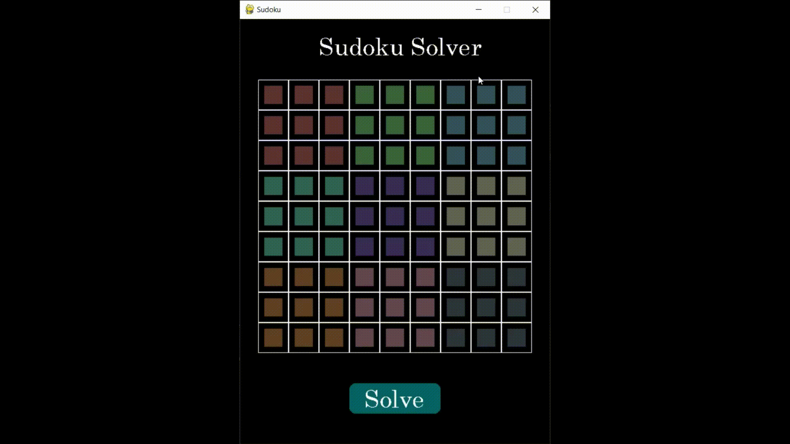

# Sudoku-Bot

# Sudoku

***Sudoku  is a logic-based, combinatorial number-placement puzzle.***

*In classic Sudoku, the objective is to fill a 9 × 9 grid with digits so that each column, each row, and each of the nine 3 × 3 subgrids that compose the grid (also called "boxes", "blocks", or "regions") contain all of the digits from 1 to 9. The puzzle setter provides a partially completed grid, which for a well-posed puzzle has a single solution.*

*Tackle the puzzle at your own* : ***[Play Free Sudoku online - solve web sudoku puzzles](https://sudoku.com/)***

# Sudoku-Bot

* *Sudoku Bot is a beautiful looking interactive sudoku interface made entirely in python that uses* ***Wave Function Collapse Algorithm*** *to solve the puzzle.*
* *This project was inspired by Martin Donald's video* : ***[Superpositions, Sudoku, the Wave Function Collapse Algorithm](https://www.youtube.com/watch?v=2SuvO4Gi7uY&t=1s)***
* *Read more about Wave Function Collapse Algorithm here*: ***[Wave Function Collapse Explained - BorisTheBrave.Com](https://www.boristhebrave.com/2020/04/13/wave-function-collapse-explained/)***

# Scripts

* ***main.py*** - *Contains the main game loop.*
* ***gui.py*** - *Contains code to handles all the GUI functionalities using pygame.*
* ***grid.py*** - *Contains the Wave Function Collapse algorithm and other utilities to solve the grid puzzle.*
* ***cell.py*** - *Contains functions and utilities for each cell on the sudoku grid.*

# Bot in action :)

